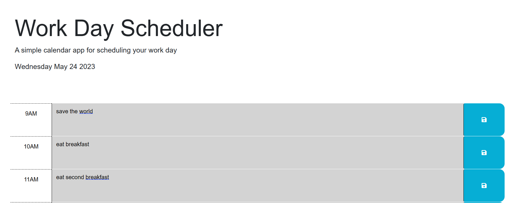

# work-day-scheduler

## Description

This project takes template code from the repo below and adds in Javascript functions so that the page functions as a work day calendar app! You can save events on the page by typing into a time block and the time bocks are color-coded based on the current time. The project uses DayJS and also displays the current date. Enjoy!
https://github.com/coding-boot-camp/crispy-octo-meme

## Installation

No installation required! This is simply a webpage! Access the page here: https://branchwag.github.io/work-day-scheduler/

## Usage

Save events on the page by typing into a time block! Screenshot of page below:

## Credits

This page utilizes DayJS and jQuery:
https://day.js.org/en/
https://jquery.com/

I would also like to thank this StackOverflow article for leading me in the right direction with my localStorage:
https://stackoverflow.com/questions/9896348/html5-javascript-store-dynamic-variable-name-and-value-in-localstorage

Columbia Coding Bootcamp

## License

MIT License

## How to Contribute

Follow the [Contributor Covenant](https://www.contributor-covenant.org/)!

## Tests

Keep in mind the current time as this app only has timeslots from 9am to 5pm! If outside 5pm, all slots should be grey. If between 9am-5pm, the app should highlight the current hour red and future hours green.
